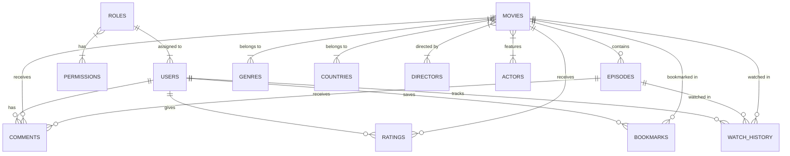
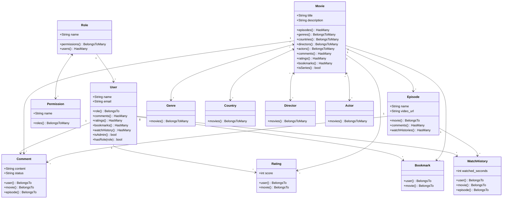

<div align="center">
  <h1>🎬 VMovies - Nền Tảng Xem Phim Trực Tuyến</h1>
  <p>Hệ thống xem phim trực tuyến hiện đại với CMS quản trị toàn diện, xây dựng trên nền tảng Laravel 11 và React (Inertia.js).</p>
</div>

---

## 🌟 Giới thiệu

**VMovies** là một dự án nền tảng xem phim trực tuyến (Movie Streaming Platform) bao gồm trang web dành cho người xem và hệ thống CMS dành cho Quản trị viên. Hệ thống được thiết kế theo kiến trúc monolithic kết hợp SPA (Single Page Application) giúp mang lại trải nghiệm mượt mà, tốc độ tải trang cực nhanh và quản lý dữ liệu dễ dàng.

## 👥 Đối tượng sử dụng & Quyền hạn

| Đối tượng | Quyền hạn |
|---|---|
| **Khách vãng lai (Guest)** | Xem phim, tìm kiếm, xem thông tin chi tiết phim, danh sách tập, đọc bình luận. (Không có tính năng cá nhân hóa). |
| **Thành viên (Member)** | Đầy đủ quyền của khách + Thêm vào Tủ phim (Bookmark), Lịch sử xem phim, Đánh giá phim, Bình luận, Cập nhật hồ sơ cá nhân. |
| **Quản trị viên (Admin)** | Toàn quyền truy cập vào bảng điều khiển (CMS). Quản lý toàn bộ nội dung (Phim, Tập, Thể loại, Nhân sự), kiểm duyệt bình luận và quản lý người dùng. |

---

## 🚀 Các chức năng chính (Features)

### 🛠️ Dành cho Quản trị viên (CMS)
- **Bảng điều khiển (Dashboard):** Thống kê tổng quan số liệu về Phim, Người dùng, Bình luận,...
- **Quản lý Phim (Movies):** Thêm/Sửa/Xóa (Hỗ trợ Soft Delete), quản lý các quan hệ (Thể loại, Quốc gia, Đạo diễn, Diễn viên).
- **Quản lý Tập phim (Episodes):** Thêm tập mới, tạo hàng loạt (Bulk create), sắp xếp thứ tự tập (Reorder).
- **Quản lý Danh mục:** Phân loại theo Thể loại (Genres) và Quốc gia (Countries).
- **Quản lý Nhân sự phim:** Đạo diễn (Directors), Diễn viên (Actors).
- **Quản lý Người dùng:** Xem danh sách, cập nhật thông tin, cấm/mở cấm (Ban/Unban) tài khoản.
- **Kiểm duyệt Bình luận:** Xem danh sách bình luận chờ duyệt (Pending), phê duyệt (Approve) hoặc xóa (Xóa).

### 👤 Dành cho Người xem (Viewer / Member)
- **Xác thực người dùng:** Đăng nhập, Đăng ký, Quên mật khẩu, Đăng xuất (xác thực qua Laravel Sanctum).
- **Khám phá phim:** Xem phim theo danh sách (Mới cập nhật, Nổi bật), Lọc phim theo Thể loại và Quốc gia.
- **Trải nghiệm Xem phim:** Trình phát video (Video Player), chuyển tập mượt mà, thông tin chi tiết phim, điểm số đánh giá.
- **Hồ sơ cá nhân:** Cập nhật thông tin tài khoản, đổi mật khẩu, xóa tài khoản an toàn.
- **Tương tác (Sắp hoàn thiện):** Đánh giá (Rating), Bình luận (Comment), Tủ phim (Bookmark), Lịch sử xem (Watch History).

---

## 💻 Công nghệ sử dụng (Tech Stack)

Dự án đã được nâng cấp và triển khai trên các công nghệ hiện đại nhất:

**Backend:**
- **Framework:** Laravel 11.x (PHP 8.2+)
- **Authentication:** Laravel Sanctum & Laravel Breeze
- **Database:** MySQL / PostgreSQL
- **Architecture:** Mô hình MVC kết hợp Service Pattern (Ví dụ: `CommentService`)

**Frontend:**
- **Library:** React 18
- **SPA Bridge:** Inertia.js 2.0 (Giao tiếp mượt mà giữa Laravel và React không cần xây dựng API RESTful riêng lẻ cho Views)
- **Styling:** Tailwind CSS 3.x, Headless UI
- **Build Tool:** Vite

---

## 📊 Sơ đồ Dữ liệu & Biểu đồ Lớp (ERD & Class Diagram)

### 1. Sơ đồ Thực thể Kết nối (ERD)
Sơ đồ dưới đây mô tả mối quan hệ giữa các thực thể trong cơ sở dữ liệu của dự án.



### 2. Biểu đồ Lớp (Class Diagram)
Biểu đồ lớp thể hiện kiến trúc các Model trong Laravel và các mối quan hệ (Relationships) giữa chúng.



### 3. Chi tiết các bảng CSDL (Database Schema)

Dưới đây là chi tiết các trường (columns) quan trọng trong các bảng dữ liệu chính của hệ thống:

#### Bảng `users` (Người dùng)
| Column | Type | Description |
|---|---|---|
| `id` | BigInt | Primary Key |
| `name` | String | Tên hiển thị |
| `email` | String | Email đăng nhập (Unique) |
| `password` | String | Mật khẩu (đã hash) |
| `avatar_url` | String | Link ảnh đại diện (Nullable) |
| `is_admin` | Boolean | Cờ đánh dấu tài khoản Admin (`true`/`false`) |
| `status` | Enum | Trạng thái tài khoản: `active`, `banned` |

#### Bảng `movies` (Phim)
| Column | Type | Description |
|---|---|---|
| `id` | BigInt | Primary Key |
| `title` | String | Tên phim |
| `original_title`| String | Tên gốc của phim |
| `slug` | String | Đường dẫn tĩnh (Unique) |
| `poster_url` | String | Link ảnh dọc (Poster) |
| `banner_url` | String | Link ảnh ngang (Banner) |
| `trailer_url` | String | Link video trailer |
| `summary` | Text | Tóm tắt nội dung phim |
| `release_year` | Year | Năm phát hành |
| `status` | Enum | Tình trạng: `ongoing` (Đang chiếu), `completed` (Hoàn thành) |
| `type` | Enum | Loại phim: `movie` (Phim lẻ), `series` (Phim bộ) |
| `view_count` | BigInt | Tổng lượt xem |
| `average_rating`| Decimal(3,2)| Điểm đánh giá trung bình |

#### Bảng `episodes` (Tập phim)
| Column | Type | Description |
|---|---|---|
| `id` | BigInt | Primary Key |
| `movie_id` | BigInt | Foreign Key -> `movies` |
| `episode_number`| Integer | Số thứ tự tập |
| `arc_name` | String | Tên phần (nếu có, VD: Mùa 1, Arc Wano) |
| `title` | String | Tiêu đề riêng của tập (nếu có) |
| `video_url` | String | Link nguồn video để stream |
| `duration` | Integer | Thời lượng tập (tính bằng giây) |
| `views` | BigInt | Lượt xem của tập |

#### Bảng `comments` (Bình luận)
| Column | Type | Description |
|---|---|---|
| `id` | BigInt | Primary Key |
| `user_id` | BigInt | Foreign Key -> `users` |
| `movie_id` | BigInt | Foreign Key -> `movies` |
| `episode_id` | BigInt | Foreign Key -> `episodes` (Nullable) |
| `content` | Text | Nội dung bình luận |
| `is_approved` | Boolean | Trạng thái duyệt (Dùng cho kiểm duyệt) |

#### Bảng `watch_history` (Lịch sử xem)
| Column | Type | Description |
|---|---|---|
| `id` | BigInt | Primary Key |
| `user_id` | BigInt | Foreign Key -> `users` |
| `movie_id` | BigInt | Foreign Key -> `movies` |
| `episode_id` | BigInt | Foreign Key -> `episodes` |
| `watched_seconds`| Integer | Thời gian đã xem tới (giây) để Resume |

#### Các bảng Danh mục (Categories & People)
**1. Bảng `genres` (Thể loại) & `countries` (Quốc gia)**
| Column | Type | Description |
|---|---|---|
| `id` | BigInt | Primary Key |
| `name` | String | Tên danh mục (Ví dụ: Hành động, Hàn Quốc) |
| `slug` | String | URL tĩnh (Ví dụ: hanh-dong) - Unique |
| `description` | Text | Mô tả chi tiết (Chỉ có ở bảng `genres`) |
| `icon_url` | String | Hình ảnh icon/đại diện |

**2. Bảng `directors` (Đạo diễn) & `actors` (Diễn viên)**
| Column | Type | Description |
|---|---|---|
| `id` | BigInt | Primary Key |
| `name` | String | Tên đạo diễn / Diễn viên |
| `bio` | Text | Tiểu sử (Nullable) |
| `image_url` | String | Ảnh chân dung (Nullable) |

#### Các bảng Pivot (Trung gian nhiều-nhiều)
Các bảng này dùng để thiết lập quan hệ Many-to-Many giữa Phim và các Thực thể liên quan:
- **`movie_genre`**: Chứa `movie_id` và `genre_id`.
- **`movie_country`**: Chứa `movie_id` và `country_id`.
- **`movie_director`**: Chứa `movie_id` và `director_id`.
- **`movie_actor`**: Chứa `movie_id`, `actor_id`, và bổ sung thêm trường **`role_name`** (để lưu tên nhân vật hoặc vai diễn của diễn viên trong bộ phim đó).

*Lưu ý: Tất cả các bảng Pivot trên đều được thiết lập khóa **Unique** kết hợp (ví dụ: `movie_id` + `actor_id`) để đảm bảo không bị trùng lặp bộ đôi dữ liệu.*

#### Các bảng Tương tác & Phân quyền khác
**1. Bảng `ratings` (Đánh giá phim)**
| Column | Type | Description |
|---|---|---|
| `user_id` | BigInt | Khóa ngoại -> `users` |
| `movie_id` | BigInt | Khóa ngoại -> `movies` |
| `score` | TinyInt | Điểm số đánh giá (Từ 1-5 sao) |
| `review_text` | Text | Lời bình/Nhận xét chi tiết (Nullable) |
| `helpful_count`| Integer | Lượt bình chọn là đánh giá hữu ích |

**2. Bảng `bookmarks` (Tủ phim cá nhân)**
| Column | Type | Description |
|---|---|---|
| `user_id` | BigInt | Khóa ngoại -> `users` |
| `movie_id` | BigInt | Khóa ngoại -> `movies` |
| `bookmarked_at`| Timestamp| Thời gian bấm lưu vào tủ phim |

**3. Bảng Phân quyền Admin**
Gồm 3 bảng liên kết theo mô hình RBAC (Role-Based Access Control):
- **`roles`**: Gồm `id`, `name`, `display_name`, `description`.
- **`permissions`**: Gồm `id`, `name`, `display_name`, `description`.
- **`role_permissions`**: Gồm `role_id`, `permission_id` (Bảng trung gian thiết lập quyền hành cho vai trò).

---

## 📂 Cấu trúc thư mục (Project Structure)

```text
vmovies/
├── app/
│   ├── Http/Controllers/    # Chứa các Controller xử lý logic (Admin, Auth, Viewer)
│   ├── Models/              # Các Eloquent Models (Movie, Episode, User, Role, Comment...)
│   └── Services/            # Nơi chứa Business Logic (ví dụ: CommentService)
├── database/
│   ├── migrations/          # Schema database (Bảng movies, episodes, pivot tables...)
│   └── seeders/             # Dữ liệu mẫu ban đầu
├── resources/
│   └── js/
│       └── Pages/           # Các React Components (Inertia Pages)
│           ├── Admin/       # Giao diện CMS cho Admin
│           ├── Auth/        # Giao diện Đăng nhập/Đăng ký
│           ├── Profile/     # Giao diện quản lý hồ sơ người dùng
│           └── Viewer/      # Giao diện xem phim cho Khách/Thành viên
├── routes/
│   ├── web.php              # Routing cho SPA Inertia
│   └── api.php              # Routing cho API endpoints
└── ...
```

---

## 🛠️ Hướng dẫn cài đặt & Chạy dự án (Local Development)

### Yêu cầu môi trường:
- PHP >= 8.2
- Composer
- Node.js & npm
- MySQL / PostgreSQL Server

### Các bước cài đặt:

1. **Clone repository và cài đặt thư viện PHP:**
   ```bash
   git clone <repo-url> vmovies
   cd vmovies
   composer install
   ```

2. **Cài đặt thư viện Node.js:**
   ```bash
   npm install
   ```

3. **Cấu hình môi trường (.env):**
   ```bash
   cp .env.example .env
   php artisan key:generate
   ```
   *Nhớ cấu hình thông tin kết nối Database trong file `.env`.*

4. **Chạy Migration & Seed Database:**
   ```bash
   php artisan migrate
   # Nếu có seeder: php artisan db:seed
   ```

5. **Khởi chạy ứng dụng (Chạy song song Backend & Frontend):**
   ```bash
   npm run dev
   # Câu lệnh này sẽ dùng concurrently để chạy cả "php artisan serve" và "vite"
   ```

6. Truy cập ứng dụng tại: `http://localhost:8000`

---

## 🚦 Yêu cầu phi chức năng (Non-functional Requirements)
- **Giao diện:** Responsive, tối ưu hóa cho màn hình Mobile & Desktop. Sử dụng Tailwind CSS linh hoạt.
- **Hiệu năng:** SPA mượt mà không load lại trang, áp dụng Cache cho các truy vấn nặng.
- **Bảo mật:** CSRF Protection (Inertia), XSS Protection, SQL Injection Protection (Eloquent ORM), Authorization/Policies bảo vệ các API Admin.

---

> **Mọi thắc mắc hoặc góp ý, vui lòng liên hệ nhóm phát triển!**
